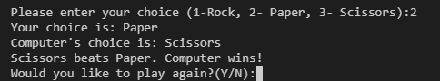

# ROCK, PAPER, SCISSORS GAME.

This game is a python terminal game, which runs in the code institute mock 
terminal on Heroku.

## How to play

Rock paper scissors is a hand game, usually played between two people, in which 
each player forms one of three shapes with an outstretched hand. These shapes are 
"rock" (a closed fist), "paper" (a flat hand), and "scissors" 
(a fist with the index finger and middle finger extended, forming a V).
it has three possible outcomes:a draw, a win, or a loss. A player who decides to
play rock will beat another player who chooses scissors ("rock crushes scissors"
or "breaks scissors" or sometimes "blunts scissors"), but will lose to one who has 
played paper ("paper covers rock"); a play of paper will lose to a play of scissors
("scissors cuts paper"). If both players choose the same shape, the game is tied
and is usually replayed to break the tie.

## FEATURES
### Some of the existing features are:
* Features of when there is a draw, when both players happen to choose same numbers

* Some of the rules of the game in order to help play properly

* when the user wins probably the user chose Rock.

* when computer wins

## TESTING
I have tested the codes in few ways which are mentioned below:
* I passed the code through pep8 linter and i can confidently state that no error 
was found or detected.
* i have also added a number not required and i got the desired error meesage.
* i also tested in my local terminal.

## BUGS
Those solved.
* while writing the code i came across some indentation and syntax error but 
i was able to identify them and solved it.
* i also came across 'whitespace' error around oprators but i also corrected it.

There were no unsolved bugs.

## DEPLOYMENT
 this project was deployed using code institute's mock heroku terminal. and 
 some of the steps taking for deployments are:
 * create a new Heroku app
 * set the buildbacks to python and nodejs accordingly
 * Link the Heroku app to repository and finally,
 * clicked on deploy.
